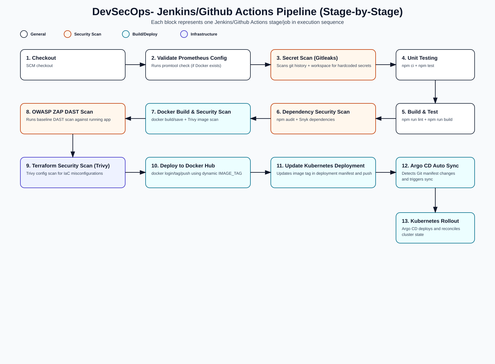

# DevSecOps Project: StreamGen AI

This repository is primarily a **DevSecOps implementation project**.  
`StreamGen AI` is the sample application used to validate secure CI/CD, container security, infrastructure-as-code, and Kubernetes delivery practices.

## DevSecOps Focus Areas

- Secure CI/CD with GitHub Actions (`.github/workflows/ci.yml`)
- Shift-left security checks in pipeline stages
- Container image build, scan, and publish workflow
- Kubernetes deployment automation using versioned manifests
- Infrastructure provisioning with Terraform for AWS EKS
- Alternate enterprise pipeline support via Jenkins (`Jenkinsfile`)

## End-to-End DevSecOps Flow



1. Code changes are pushed to the repository.
2. CI runs tests and build validation.
3. Security checks run for dependencies, containers, and IaC.
4. Docker image is built and scanned.
5. On main branch, validated image is pushed to registry.
6. Kubernetes manifests are updated for deployment rollout.
7. Infrastructure is managed as code through Terraform (EKS-ready).

## Repository Structure

```text
streamgen-ai/
├── .github/workflows/ci.yml   # Main DevSecOps CI/CD + security workflow
├── Jenkinsfile                # Jenkins-based CI/Sec pipeline alternative
├── Dockerfile                 # Multi-stage container build
├── kubernetes/                # Kubernetes Deployment + Service manifests
├── terraform/                 # AWS VPC + EKS IaC definitions
├── services/                  # App service integrations + unit tests
├── components/                # Frontend UI components
└── README.md
```

## Security Controls in CI/CD

- Unit tests as quality gate (`npm test`)
- Dependency vulnerability checks (`npm audit`, Snyk)
- Container image vulnerability scanning (Trivy, Snyk Container)
- DAST baseline scan (OWASP ZAP)
- Terraform/IaC security scanning (Trivy config scan)

## CI/CD Secrets (GitHub Actions)

Set these in repository secrets:

- `DOCKER_USERNAME`
- `DOCKER_PASSWORD`
- `SNYK_TOKEN`
- `TOKEN` (used to commit Kubernetes manifest updates)

## Local Development (Application)

The app is included to support DevSecOps validation.

### Prerequisites

- Node.js 20+
- npm


### Run locally

```bash
npm ci
npm run dev
```

App URL: `http://localhost:3000`

## Container Workflow

### Build

```bash
docker build -t streamgen-ai:local .
```

### Run

```bash
docker run --rm -p 3000:80 streamgen-ai:local
```

# Prometheus Monitoring

This repository includes a **Prometheus + Grafana monitoring stack** for:

- Host metrics
- Container metrics
- Kubernetes metrics
- Jenkins metrics

It uses the official `kube-prometheus-stack` Helm chart from the Prometheus Community.

---

## Prerequisites

- A running Kubernetes cluster
- `kubectl` configured
- Helm installed

---

## Install Helm (if not installed)

```bash
sudo snap install helm --classic
```

## Verify installation:

```bash
helm version
```

## Add the Prometheus Helm Repository

```bash
helm repo add prometheus-community https://prometheus-community.github.io/helm-charts
helm repo update
```

## Install the Monitoring Stack

```bash
kubectl create namespace monitoring
helm install monitoring prometheus-community/kube-prometheus-stack \
  --namespace monitoring
```
## Verify Installation

```bash
kubectl get pods -n monitoring
```

## Kubernetes Deployment

Manifests are in `kubernetes/`:

- `deployment.yaml`
- `service.yaml`

These manifests are used by the pipeline for deployment updates.

## Infrastructure as Code

Terraform config in `terraform/main.tf` provisions:

- AWS provider setup
- VPC module
- Private EKS cluster module
- Supporting security group and outputs

Current default AWS region: `ap-south-1`.

## Sample Application Stack

The sample app uses:

- React 19
- TypeScript
- Vite 6
- Vitest

## Notes

- The workflow references `npm run lint || true`, but a `lint` script is not currently defined in `package.json`.
