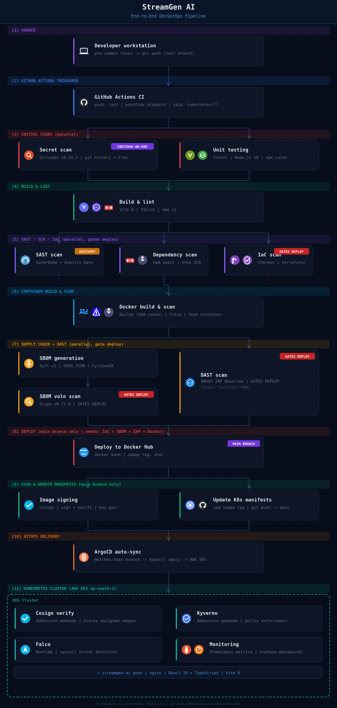

# StreamGen AI — DevSecOps Pipeline

<div align="center">


</div>

StreamGen AI is a React 19 + TypeScript + Vite 6 application deployed on AWS EKS with a fully automated, security-first CI/CD pipeline powered by GitHub Actions and ArgoCD.

---

## Table of Contents

- [Architecture Overview](#architecture-overview)
- [Repository Structure](#repository-structure)
- [CI/CD Pipeline](#cicd-pipeline)
  - [Pipeline Stages](#pipeline-stages)
  - [Gate Chain](#gate-chain)
- [Security Controls](#security-controls)
  - [Shift-Left (Pre-Pipeline)](#shift-left-pre-pipeline)
  - [Pipeline Gates](#pipeline-gates)
  - [In-Cluster Security](#in-cluster-security)
- [GitOps with ArgoCD](#gitops-with-argocd)
- [Infrastructure (Terraform + EKS)](#infrastructure-terraform--eks)
- [GitHub Actions Configuration](#github-actions-configuration)
- [Local Development](#local-development)
- [Container Workflow](#container-workflow)
- [Pipeline Artifacts](#pipeline-artifacts)
- [Monitoring](#monitoring)

---

## Architecture Overview



---

## Repository Structure

```
DevSecOps/
├── .github/
│   └── workflows/
│       └── ci.yml                  # 16-stage GitHub Actions pipeline
├── .gitleaks.toml                  # Gitleaks secret scan config
├── kubernetes/
│   ├── deployment.yaml             # K8s Deployment (image tag auto-updated by pipeline)
│   └── service.yaml                # K8s Service
├── terraform/
│   ├── main.tf                     # AWS VPC + EKS provisioning
│   ├── variables.tf
│   └── outputs.tf
├── src/                            # React 19 + TypeScript source
├── public/
├── Dockerfile                      # Multi-stage: Node build → nginx serve
├── Jenkinsfile                     # Alternative Jenkins pipeline
├── sonar-project.properties        # SonarQube project config
├── vite.config.ts
├── vitest.config.ts
├── eslint.config.js
├── package.json
└── package-lock.json
```

---

## CI/CD Pipeline

### Pipeline Stages

Triggered on `push` to the `test` branch (excluding `kubernetes/**` changes) and `workflow_dispatch`. Deployment jobs are conditionally gated to `main`.

| # | Job | Tool(s) | Needs | Gates Deploy? |
|---|-----|---------|-------|:---:|
| 1 | **Secret Scan** | Gitleaks v8.24.3 — git history + no-git | — | ✅ |
| 2 | **Unit Tests** | Vitest, Node 20, npm cache | — | ✅ |
| 3 | **Build & Lint** | Vite 6, ESLint, npm ci | 1 + 2 | ✅ |
| 4 | **SonarQube SAST** | SonarQube scan + Quality Gate | 3 | ⚠️ Advisory |
| 5 | **Dependency Scan** | npm audit + Snyk SCA | 3 | ✅ |
| 6 | **IaC Scan** | Checkov on `terraform/` → JSON artifact | 3 | ✅ |
| 7 | **Docker Build & Scan** | Buildx (GHA cache) + Trivy + Snyk Container | 5 | ✅ |
| 8 | **SBOM Generate** | Syft v1 → SPDX-JSON + CycloneDX-JSON | 7 | ✅ |
| 9 | **SBOM Scan** | Grype v0.77.0 (Docker) on SPDX SBOM | 8 | ✅ |
| 10 | **OWASP ZAP DAST** | `zaproxy/action-baseline@v0.14.0` on `localhost:3000` | 7 | ✅ |
| 11 | **Deploy** | Docker Hub push *(main only)* | 6 + 9 + 10 + 7 | — |
| 12 | **Sign Image** | Cosign sign + verify (key pair) *(main only)* | 11 | — |
| 13 | **Update K8s** | `sed` image tag + `git push` *(main only)* | 11 | — |
| 14 | **ArgoCD Sync** | Auto-sync from main branch | 13 (git commit) | — |
| 15 | **Cosign Verify** | Admission webhook — signature check | ArgoCD sync | — |
| 16 | **Kyverno + Falco** | Policy enforcement + runtime monitoring | Pod schedule | — |

### Gate Chain

The deploy job will only run when **all four** of these pass on the `main` branch:

```
                  ┌─────────────────────┐
                  │   iac-scan-checkov  │ ──┐
                  └─────────────────────┘   │
                                            │
secret-scan ──┐                             │
              ├──► build ──► dep-scan ──► docker ──► sbom-gen ──► sbom-scan ──┐
unit-test ────┘                                                                │
                                            │                                 │
                              docker ──► zap-dast ───────────────────────────►│
                                                                               │
                                                                          [ deploy ]
                                                                           ┌──┴──┐
                                                                    [sign-image] [update-k8s]
                                                                                      │
                                                                             [ArgoCD auto-sync]
                                                                                      │
                                                                      [Cosign verify (admission)]
                                                                      [Kyverno (admission)]
                                                                      [Falco (runtime)]
```

---

## Security Controls

### Shift-Left (Pre-Pipeline)

| Tool | Purpose |
|------|---------|
| **pre-commit hooks** | Catch issues before `git push` |
| **Gitleaks** (`.gitleaks.toml`) | Custom rules for secret detection in commits |
| **ESLint** | Enforces static code quality standards |

### Pipeline Gates

| Layer | Tool | What It Checks |
|-------|------|----------------|
| Secrets | Gitleaks v8.24.3 | Leaked credentials in full git history and working tree |
| SAST | SonarQube + Quality Gate | Vulnerabilities, code smells, test coverage |
| SCA | npm audit + Snyk | Known CVEs in npm dependencies (≥ medium severity) |
| IaC | Checkov | Misconfigurations in Terraform (`terraform/`) |
| Container | Trivy | OS + application layer CVEs in the Docker image |
| Container | Snyk Container | Additional container CVE analysis (advisory) |
| SBOM | Syft | Generates a full software bill of materials (SPDX + CycloneDX) |
| SBOM Vuln | Grype | CVE scan against the SPDX SBOM |
| DAST | OWASP ZAP Baseline | Runtime vulnerability scan against the live running container |
| Supply Chain | Cosign | Signs published image; verifies signature at admission time |

### In-Cluster Security

| Tool | Layer | Role |
|------|-------|------|
| **Cosign** | Admission | Blocks unsigned or tampered images from being admitted to the cluster |
| **Kyverno** | Admission | Enforces pod security policies — e.g. no `privileged` containers, required labels, allowed registries |
| **Falco** | Runtime | Syscall-level anomaly detection; alerts on privilege escalation, unexpected file access, and shell spawns inside containers |

---

## GitOps with ArgoCD

ArgoCD watches the `main` branch of this repository. When the `update-k8s` job commits a new image tag to `kubernetes/deployment.yaml`, ArgoCD detects the configuration drift and automatically syncs the cluster state — no manual `kubectl apply` required.

```
Pipeline push (image tag)
       │
       ▼
kubernetes/deployment.yaml updated on main
       │
       ▼
ArgoCD detects drift → triggers sync
       │
       ▼
kubectl apply → new pods scheduled
       │
       ├── Cosign verify (admission webhook) — rejects unsigned images
       ├── Kyverno policy check (admission webhook) — enforces pod standards
       │
       ▼
Pods running → Falco monitors syscalls at runtime
```

The manifest update in the pipeline:

```bash
sed -i "s|image: .*|image: paripuranam/streamgen-ai:<sha7>|g" kubernetes/deployment.yaml
git commit -m "Update Kubernetes deployment with new image tag: <sha7>"
git push
```

Requires the `TOKEN` secret — a GitHub PAT with repo write access.

---

## Infrastructure (Terraform + EKS)

The `terraform/` directory provisions:

- **AWS VPC** — custom VPC with public/private subnets across AZs in `ap-south-1`
- **AWS EKS** — managed Kubernetes control plane in private subnets
- **Managed Node Groups** — EC2 worker nodes for application workloads
- **IAM Roles** — cluster and node group roles with least-privilege policies

```bash
cd terraform/
terraform init
terraform plan
terraform apply
```

Every pipeline run scans this directory with Checkov and uploads the full results as the `checkov-report` artifact.

---

## GitHub Actions Configuration

### Required Secrets

Configure these in **Settings → Secrets and variables → Actions**:

| Secret | Used By | Purpose |
|--------|---------|---------|
| `DOCKER_USERNAME` | docker-build, deploy, sign-image | Docker Hub registry login |
| `DOCKER_PASSWORD` | docker-build, deploy, sign-image | Docker Hub registry password |
| `SNYK_TOKEN` | dependency-scan, docker-build | Snyk SCA and container scanning |
| `SONAR_TOKEN` | sonarqube-scan | SonarQube authentication token |
| `SONAR_HOST_URL` | sonarqube-scan | SonarQube server URL |
| `COSIGN_PRIVATE_KEY` | sign-image | Cosign private key for image signing |
| `COSIGN_PUBLIC_KEY` | sign-image | Cosign public key for signature verification |
| `COSIGN_PASSWORD` | sign-image | Passphrase for the Cosign private key |
| `TOKEN` | update-k8s | GitHub PAT for pushing K8s manifest changes |

### Branch Strategy

| Branch | Pipeline Behaviour |
|--------|-------------------|
| `test` | Runs all scan and build jobs; skips `deploy`, `sign-image`, `update-k8s` |
| `main` | Full pipeline including Docker Hub push, Cosign signing, and K8s manifest update |

---

## Local Development

### Prerequisites

- Node.js 20+
- Docker
- npm

### Setup

```bash
# Clone the repository
git clone https://github.com/paripuranam/DevSecOps.git
cd DevSecOps

# Install dependencies
npm ci

# Start development server
npm run dev

# Run unit tests
npm test

# Run linter
npm run lint

# Production build
npm run build
```

---

## Container Workflow

### Build & Run Locally

```bash
# Build the image
docker build -t streamgen-ai:local .

# Run locally (nginx serves on port 80, mapped to 3000)
docker run -p 3000:80 streamgen-ai:local
```

The Dockerfile uses a **multi-stage build**:
1. **Stage 1 — build:** Node 20 Alpine — installs dependencies and runs `vite build`
2. **Stage 2 — serve:** nginx Alpine — serves the compiled `dist/` output

### Image Signing (Cosign)

```bash
# Generate a key pair (one-time setup)
cosign generate-key-pair

# Sign a pushed image
cosign sign --key cosign.key paripuranam/streamgen-ai:<tag>

# Verify the signature
cosign verify --key cosign.pub paripuranam/streamgen-ai:<tag>
```

### Vulnerability Scan (Grype)

```bash
# Scan image directly
grype paripuranam/streamgen-ai:<tag>

# Scan from SBOM
grype sbom:streamgen-ai-sbom.spdx.json
```

---

## Pipeline Artifacts

Every pipeline run produces the following downloadable artifacts in the GitHub Actions run summary:

| Artifact | Contents |
|----------|---------|
| `streamgen-ai` | Docker image tarball (`streamgen-ai.tar`) |
| `sbom-reports` | `streamgen-ai-sbom.spdx.json` + `streamgen-ai-sbom.cdx.json` |
| `grype-report` | `grype-report.json` — CVE scan results from SBOM |
| `checkov-report` | `terraform-checkov-report.json` — IaC scan results |
| `zap_report` | ZAP HTML, JSON, and Markdown DAST reports |

---

## Monitoring

Prometheus and Grafana are deployed in the EKS cluster for full-stack observability:

| Component | Role |
|-----------|------|
| **Prometheus** | Scrapes metrics from pods, nodes, and kube-state-metrics |
| **Grafana** | Dashboards for cluster health, pod performance, and application metrics |
| **Falco** | Runtime security alerts surfaced into the observability stack |

---

## License

This project is for educational and portfolio purposes.
